<!-- Banner: custom SVG hosted in this repo (assets/header.svg) -->
<p align="center">
  <picture>
    <source media="(prefers-color-scheme: dark)" srcset="./assets/header.svg"/>
    
  </picture>
</p>

<p align="center">
  
</p>

<p align="center">
  <a href="https://dmlabs.mx"></a>
  <a href="mailto:damian.torres@dmlabsgroup.com"></a>
  <a href="https://linkedin.com/in/damiantorresmx"></a>
  <a href="https://github.com/damiantorresmx11?tab=followers"></a>
  
</p>

<p align="center">
  
  
  
  
</p>

<br/>

<table align="center" border="0">
<tr>
<td width="55%" valign="top">

### `$ cat about.md`

I'm the founder of **[DMLABS](https://dmlabs.mx)**, a software & offensive-security consultancy. I've spent 7+ years on both sides of the keyboard: shipping full-stack products for clients and then breaking them in pentest engagements so nobody else does first.

Today I lead technical execution at DMLABS, run security audits, and build AI agents that do real operational work. I also serve as Director of Development & Security at Provein Proveedores Industriales.

- 🔭 Building **DMLABS Health**, vertical SaaS for clinics
- 🤖 Shipping **Dex**, our in-house AI operations agent
- 🛡️ Maintaining the **DMLABS Pentest Framework**
- 🎮 Side quests in Minecraft plugins & Roblox experiments
- 💬 Ask me about web app security, agents in production, or scaling a small dev shop

</td>
<td width="45%" valign="top">

### `$ cat profile.ts`

```ts
export const damian = {
  name:     "Damian Torres",
  role:     "Founder & CEO",
  company:  "DMLABS",
  based:    "Guadalajara, MX 🇲🇽",
  years:    7,
  domains:  ["web", "offsec", "ai-agents"],
  edu: {
    degree:   "B.Eng. Cybersecurity",
    graduate: "Tec de Monterrey",
  },
  motto: "Build it. Break it. Harden it.",
} as const;
```

</td>
</tr>
</table>

<br/>

<h3 align="center">⚡ Tech Arsenal</h3>

<p align="center">
  
</p>
<p align="center">
  
</p>

<details>
<summary align="center"><b>🛡️ Offensive Security toolkit</b> — click to expand</summary>
<br/>
<p align="center">
  
  
  
  
  
  
  
  
</p>
</details>

<details>
<summary align="center"><b>🤖 AI &amp; Automation</b> — click to expand</summary>
<br/>
<p align="center">
  
  
  
  
  
  
</p>
</details>

<br/>

<h3 align="center">🚀 Featured Work</h3>

<table align="center">
<tr>
<td align="center" width="33%">
<br/>
<b>DMLABS Pentest Framework</b><br/>
<sub>Reusable methodology + tooling for web & infra audits. Recon → exploit → report, automated where it counts.</sub><br/><br/>

</td>
<td align="center" width="33%">
<br/>
<b>Dex</b><br/>
<sub>Internal operations agent for DMLABS: tickets, triage, follow-ups. Built on an open agent framework, not a chatbot wrapper.</sub><br/><br/>

</td>
<td align="center" width="33%">
<br/>
<b>DMLABS Health</b><br/>
<sub>Four vertical SaaS products for dental, medical, nutrition and psychology practices. One core, four brands.</sub><br/><br/>

</td>
</tr>
</table>

<table align="center">
<tr>
<td align="center" width="50%">
  <a href="https://github.com/damiantorresmx11/Mannatech-Demo">
    <b>Mannatech Demo</b><br/>
    
    
    
  </a>
</td>
<td align="center" width="50%">
  <a href="https://github.com/damiantorresmx11/trepacerros-blitz-gdl">
    <b>Trepacerros Blitz GDL</b><br/>
    
    
    
  </a>
</td>
</tr>
</table>

<br/>

<h3 align="center">📊 By the numbers</h3>

<p align="center">
  <picture>
    <source media="(prefers-color-scheme: dark)" srcset="https://streak-stats.demolab.com?user=damiantorresmx11&theme=dark&hide_border=true&background=0D1117&ring=00E5A0&fire=00E5A0&currStreakLabel=00E5A0&sideLabels=C9D1D9&dates=8B949E"/>
    
  </picture>
</p>

<p align="center">
  <picture>
    <source media="(prefers-color-scheme: dark)" srcset="./assets/metrics-dark.svg"/>
    
  </picture>
</p>

<picture>
  <source media="(prefers-color-scheme: dark)" srcset="https://raw.githubusercontent.com/damiantorresmx11/damiantorresmx11/output/snake-dark.svg"/>
  
</picture>

<br/>

<h3 align="center">🤝 Let's build something</h3>

<p align="center">
  Need a product built, a system audited, or an AI agent wired into your operations?<br/>
  <sub>Web & mobile apps · Penetration testing · AI agents & automation · Technical consulting</sub>
</p>

<p align="center">
  <a href="mailto:damian.torres@dmlabsgroup.com"></a>
  <a href="https://dmlabs.mx"></a>
</p>

<p align="center">
  
</p>
